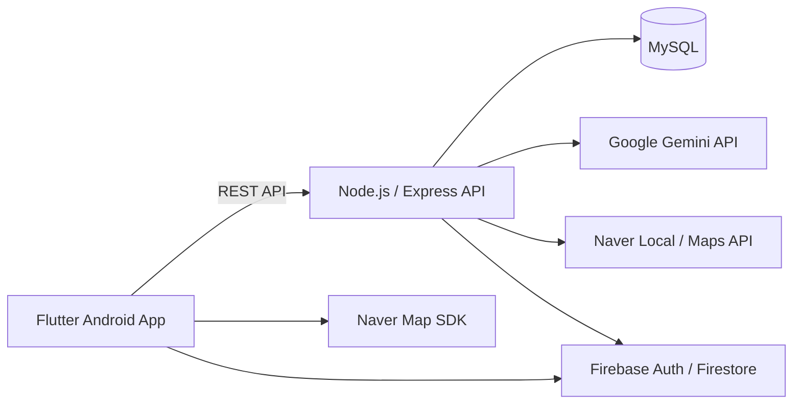

# Walking Mate

> 사용자 요청을 분석해 산책 경로를 구성하고, 산책 기록·보상·커뮤니티 기능을 연결한 Flutter 기반 Android 서비스

Walking Mate는 사용자가 원하는 장소나 분위기를 입력하면 이를 바탕으로 산책 경로를 구성하고, 실제 산책 기록을 업적·포인트·캐릭터 성장으로 연결하는 모바일 애플리케이션입니다.

Flutter 기반 Android 클라이언트와 Node.js/Express API 서버, MySQL 데이터베이스로 구성되어 있으며, Google Gemini와 Naver Maps API, Firebase를 외부 서비스로 활용합니다.

---

## Key Features

### AI-assisted Route Generation

사용자의 산책 조건을 자연어와 태그로 입력받아 산책 경로를 구성합니다.

1. Gemini를 이용해 사용자 설명에서 장소 및 핵심 키워드 추출
2. Naver Local Search API를 이용해 관련 장소 후보 탐색
3. Gemini를 이용해 출발지와 도착지를 고려한 경유지 후보 선택
4. Naver Geocoding API를 이용해 경유지 좌표 변환
5. Naver Directions API를 이용해 경로 데이터 구성
6. 생성된 경로와 거리, 예상 소요 시간을 MySQL에 저장

생성한 산책로는 공개 또는 비공개로 저장할 수 있으며, 다른 사용자의 산책로에 좋아요와 댓글을 남길 수 있습니다.

### Walk Tracking

- Naver Map 기반 산책 경로 표시
- 현재 위치 및 이동 경로 확인
- 산책 시간과 이동 거리 기록
- 산책 완료 결과 저장
- 결과 화면 이미지 생성 및 공유

### Gamification

- 산책 횟수, 누적 거리, 연속 산책 등을 기반으로 업적 진행
- 업적과 활동에 따른 포인트 지급
- 포인트를 이용한 캐릭터 및 아이템 구매
- 보유 아이템을 이용한 캐릭터 커스터마이징

### Social & Community

- 사용자 검색 및 워킹메이트 관계 관리
- Firebase Firestore 기반 실시간 1:1 채팅
- 크루 생성 및 가입
- 크루 게시판 작성 및 댓글
- 게시글과 산책로 좋아요
- 사용자 및 콘텐츠 신고

---

## Architecture



클라이언트의 일반적인 서비스 데이터는 Express REST API를 통해 MySQL에 저장하고, 실시간 채팅은 Firestore의 snapshot stream을 이용합니다.

백엔드는 로그인 시 서비스용 JWT와 함께 Firebase Custom Token을 발급하여 애플리케이션 인증과 Firebase 인증을 연결합니다.

---

## Implementation Highlights

### Gemini와 지도 API를 결합한 경로 생성

LLM에 전체 경로 생성을 맡기지 않고 역할을 분리했습니다.

Gemini는 사용자의 자연어 요청에서 검색 키워드를 추출하고 장소 후보를 선택하는 데 사용하며, 실제 장소 검색과 좌표 및 경로 데이터는 Naver API를 이용합니다.

```text
User Request
    |
    v
Gemini
Keyword Extraction
    |
    v
Naver Local Search
Candidate Places
    |
    v
Gemini
Waypoint Selection
    |
    v
Naver Geocoding / Directions
    |
    v
Route Data
    |
    v
MySQL
```

### JWT와 Firebase 인증 연결

서비스 API는 JWT 기반으로 인증합니다.

로그인에 성공하면 백엔드가 Access Token과 Refresh Token을 발급하고, 동시에 Firebase Custom Token을 생성합니다. Flutter 클라이언트는 이 Custom Token으로 Firebase Authentication에 로그인하여 Firestore 기반 기능을 사용할 수 있습니다.

비밀번호는 bcrypt를 이용해 해시한 뒤 저장합니다.

### Firestore 기반 실시간 채팅

워킹메이트 간 1:1 채팅은 Cloud Firestore를 사용합니다.

메시지를 저장할 때 Firestore transaction을 이용해 새 메시지와 채팅방의 최근 메시지 정보를 함께 갱신하며, snapshot stream을 통해 메시지 변경 사항을 클라이언트에 실시간으로 반영합니다.

### 관계형 데이터 모델링

MySQL에는 서비스의 주요 도메인을 분리하여 저장합니다.

- User / Friendship
- Walkway / Walk Record
- Crew / Crew Member
- Community Post / Comment
- Achievement / User Achievement
- Character / Item / User Item
- Point Ledger
- Report

사용자 관계, 아이템 보유, 좋아요 등 중복이 허용되지 않아야 하는 관계에는 unique constraint를 적용하고, 주요 연관 데이터에는 foreign key와 cascade 정책을 사용합니다.

---

## Tech Stack

| Category | Technologies |
| --- | --- |
| Client | Flutter, Dart, Provider, Dio |
| Backend | Node.js, Express |
| Database | MySQL, mysql2 |
| Authentication | JWT, bcrypt, Flutter Secure Storage, Firebase Authentication |
| AI | Google Gemini 2.5 Pro |
| Map & Location | Naver Map SDK, Naver Local Search API, Naver Maps API, Geolocator |
| Realtime | Firebase Cloud Firestore |

---

## Repository Structure

```text
walking-mate/
├── frontend/
│   └── walking_mate_app/
│       └── lib/
│           ├── models/
│           ├── providers/
│           ├── screens/
│           ├── services/
│           └── widgets/
│
├── backend/
│   └── walking-mate-server/
│       ├── config/
│       ├── controllers/
│       ├── helpers/
│       ├── middleware/
│       ├── routes/
│       └── app.js
│
├── db/
│   └── walkingmate.sql
│
└── README.md
```

### Frontend

Flutter 기반 Android 애플리케이션입니다.

화면 UI와 지도, 위치 추적을 담당하며 API 통신을 위한 service 계층과 Provider 기반 상태 관리를 분리하여 구성했습니다.

### Backend

Node.js와 Express 기반 REST API 서버입니다.

인증, 사용자, 산책로, 산책 기록, 친구, 커뮤니티, 업적, 상점, 캐릭터, 신고 및 관리자 기능을 도메인별 route와 controller로 분리하여 처리합니다.

### Database

MySQL 초기 스키마와 서비스 운영에 필요한 기본 데이터를 `db/walkingmate.sql`에서 관리합니다.
